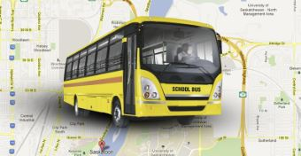

# Project Title
Real time bus tracker MIT exercise
# Description
Uses Mapbox API to display the real-time location of Boston’s MBTA buses and some event customizations.  It turns out that my mother just so happened to be on business during the time of this assignment and she was located only 10 mins away from the MIT campus so I added her location. 
# Installation
To run this project download the files and open the index.html file via a browser. Keep in mind that you should replace the API key with your own API key.  I used MapBox.
# Roadmap
One improvment could be to have the cat image follow each bus stop location.  I also removed one of the styles on the menu because to me the 'outdoor' and also the 'street' view seemed identical in appearance to me so I removed the 'street view'.
# License Information

